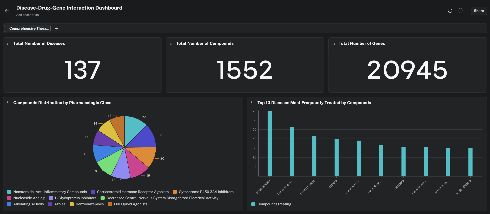
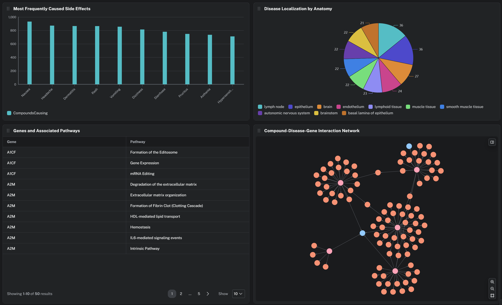

# DrugPath

**DrugPath** is an AI agent that navigates a biomedical knowledge graph to
answer questions about drugs, their mechanisms of action, interactions, and
disease connections. Instead of returning a flat yes/no answer, it traces a path
through the graph — drug → gene (target) → biological pathway → disease → side
effect — and explains the *mechanism*, not just the *what*.

This is what makes a graph the right tool. A table can tell you *"Metformin
treats type 2 diabetes."* A graph can answer *"Why might metformin work against
cancer?"* — by traversing
`(Metformin)-[:BINDS_GENE]->(SLC22A1)-[:ASSOCIATES_WITH]->(prostate cancer)`.
That 3-hop drug-repurposing inference is impossible in a flat database. Built for
the Neo4j Aura Agent Hackathon 2026.

**🌐 Live demo:** https://qualv13.github.io/neo4j-agent/

## Graph schema (summary)

**Node types:**

| Node | Count | Role |
|---|---|---|
| Compound | 1,552 | Drugs / chemical compounds (carry `embedding`) |
| Gene | 20,945 | Molecular targets and enzymes |
| Disease | 137 | Therapeutic indications |
| Pathway | 1,822 | Biological pathways (mTOR, CYP3A4, ...) |
| SideEffect | 5,734 | Adverse effects |
| PharmacologicClass | 345 | Drug classes (e.g. Biguanides) |
| Anatomy | 402 | Where diseases manifest |

**Key relationships:** `TREATS`, `PALLIATES`, `BINDS_GENE`,
`DOWNREGULATES_GENE`, `UPREGULATES_GENE`, `CAUSES_SIDE_EFFECT`,
`PARTICIPATES_IN`, `ASSOCIATES_WITH`, `LOCALIZES_TO`, `INCLUDES`.

To fit AuraDB Free limits (200k nodes / 400k relationships), all nodes load but
relationships are filtered to the ten metaedges the agent traverses (~293k). See
[`docs/runbook.md`](docs/runbook.md) for the strategy.




## Repository layout

```
neo4j agent/
├── README.md                       # this file
├── DrugPath_Hackathon_Guide.md     # full implementation spec
├── requirements.txt                # Python dependencies
├── .env.example                    # config template (copy to .env)
├── .gitignore
├── etl/                            # data pipeline, run in numeric order
│   ├── common.py                   # shared config + Neo4j driver
│   ├── 01_download_hetionet.py     # download + filter Hetionet TSVs
│   ├── 02_load_nodes.py            # load all node types + indexes
│   ├── 03_load_edges.py            # load filtered relationships
│   ├── 04_generate_embeddings.py   # embeddings + vector index (OpenAI 3-small)
│   └── 05_verify.py                # post-load sanity checks
├── agent/
│   ├── agent_config.md             # Aura Agent setup walkthrough
│   ├── system_prompt.txt           # the agent's system prompt
│   └── tools/                      # the 4 agent tools
│       ├── drug_interaction_checker.cypher
│       ├── drug_repurposing_explorer.cypher
│       ├── drug_profile_lookup.cypher
│       └── find_similar_drugs.md   # similarity-search tool config
├── docs/
│   └── runbook.md                  # zero-to-agent operator guide
├── tests/
│   ├── demo_scenarios.md           # demo questions + expected answers
│   └── validate_tools.py           # run the tool queries against the DB
└── submission/
    └── hackathon_post.md           # community.neo4j.com submission post
```

## Quick start

Follow the step-by-step operator guide: **[`docs/runbook.md`](docs/runbook.md)**.

In short: create a venv, `pip install -r requirements.txt`, copy `.env.example`
to `.env` and fill in your AuraDB Free credentials and OpenAI key, run the ETL
scripts in order (`etl/01` → `etl/05`), configure the Aura Agent
([`agent/agent_config.md`](agent/agent_config.md)), then test with
[`tests/demo_scenarios.md`](tests/demo_scenarios.md) and submit with
[`submission/hackathon_post.md`](submission/hackathon_post.md).

## Dataset and license

[Hetionet v1.0](https://github.com/hetio/hetionet) — released under **CC0 (public
domain)**, no usage restrictions. It integrates 29 public biomedical databases
(DrugBank, OMIM, DisGeNET, Reactome, Gene Ontology, SIDER, and more) into a
single graph.

## Disclaimer

⚠️ DrugPath is an **educational and research tool**. It does **not** provide
medical advice and its drug-repurposing outputs are hypotheses for researchers,
not proven treatments. Always consult a qualified healthcare professional before
making any medical decision.
