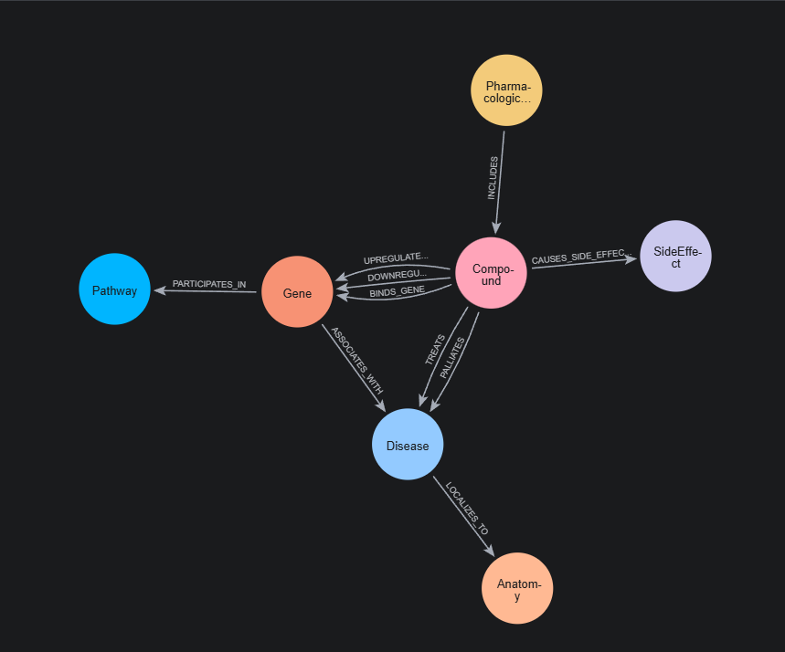
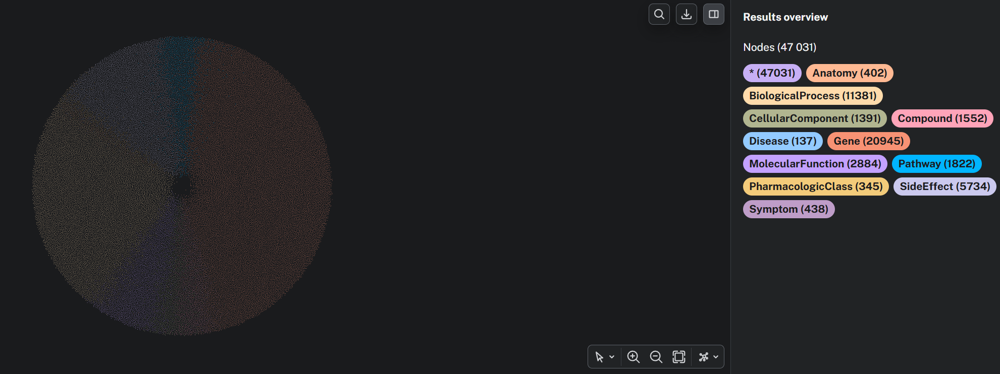
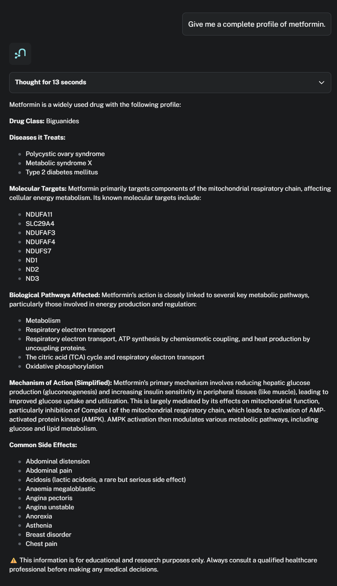
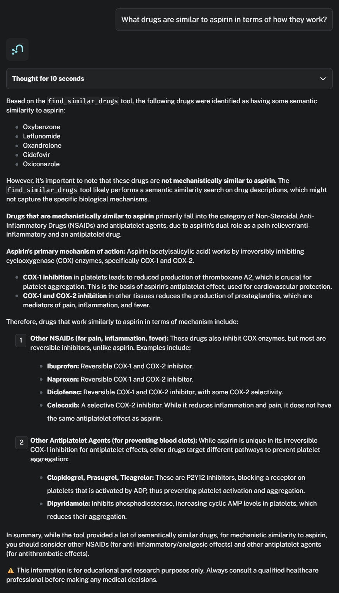

# DrugPath — Biomedical Drug Reasoning Agent

## Agent Name
**DrugPath**

## What it does

DrugPath is an AI agent that navigates a biomedical knowledge graph to answer
questions about drugs, their mechanisms of action, interactions, and disease
connections. Unlike a drug database that returns flat yes/no answers, DrugPath
**explains the biological mechanism** behind every answer by traversing
multi-hop paths through the graph.

**Three key capabilities:**

**1. Drug interaction checking with mechanism explanation**
Instead of "warfarin + aspirin = dangerous," DrugPath explains: *"These drugs
interact because warfarin inhibits VKORC1 (Vitamin K pathway) while aspirin
irreversibly blocks COX-1 — both affect different steps of the clotting cascade,
creating synergistic bleeding risk."* The answer traces the path: Drug → shared
Gene targets → Pathway → clinical outcome.

**2. Drug repurposing discovery**
*"What existing approved drugs could work for Alzheimer's?"* — This requires a
3-hop traversal: find drugs → whose molecular targets (Genes) → are associated
with Alzheimer's Disease → but the drug isn't currently indicated for it. No SQL
join can express this cleanly. In the graph it's one Cypher query.

**3. Comprehensive drug profiles**
Full pharmacological context for any drug: indications, molecular targets,
biological pathways, side effects — all pulled from graph relationships rather
than flat attributes.

## Dataset and Why a Graph Fits

**Dataset:** [Hetionet v1.0](https://github.com/hetio/hetionet) (CC0 license)
- 47,031 nodes of 11 types
- 2,250,197 relationships of 24 types in the source; we load all nodes and the
  ~293k relationships across the ten metaedges the agent traverses (AuraDB Free
  caps at 400k relationships)
- Integrates 29 public biomedical databases: DrugBank, OMIM, DisGeNET, Reactome,
  Gene Ontology, SIDER, and others

**Why a graph is the only right structure for this data:**

A relational database can tell you: *"Metformin treats Type 2 Diabetes."*

A knowledge graph can answer: *"Why might Metformin work against cancer?"*

```
(Metformin:Compound)
  -[:BINDS_GENE]-> (SLC22A1:Gene)
  -[:ASSOCIATES_WITH]-> (prostate cancer:Disease)
```

This is a real path returned by the live graph. It reveals a biologically
plausible repurposing hypothesis that is not in any flat table — it emerges from
the **structure of the graph itself**.

**Node types:**

| Node | Count | Role |
|---|---|---|
| Compound | 1,552 | Drugs and chemical compounds |
| Gene | 20,945 | Molecular targets and enzymes |
| Disease | 137 | Therapeutic indications |
| Pathway | 1,822 | Biological pathways (mTOR, CYP3A4...) |
| SideEffect | 5,734 | Adverse effects |
| PharmacologicClass | 345 | Drug classes |
| Anatomy | 402 | Where diseases manifest |

**Key relationships:** TREATS, PALLIATES, BINDS_GENE, DOWNREGULATES_GENE,
UPREGULATES_GENE, CAUSES_SIDE_EFFECT, PARTICIPATES_IN, ASSOCIATES_WITH,
LOCALIZES_TO, INCLUDES

## Agent Tools

| Tool | Type | What it enables |
|---|---|---|
| `drug_interaction_checker` | Cypher Template | Given two drug names, traverses shared gene targets and pathways to explain the interaction mechanism — not just flag it |
| `drug_repurposing_explorer` | Cypher Template | Given a disease, finds drugs approved for OTHER conditions whose molecular targets associate with this disease — pure graph reasoning |
| `drug_profile_lookup` | Cypher Template | Full pharmacological profile: targets, indications, side effects, pathways, drug class |
| `find_similar_drugs` | Similarity Search | Vector search on drug name + mechanism embeddings to find pharmacologically similar compounds |

## Example Interactions

**User:** "Can I take warfarin and aspirin together?"

**DrugPath:** "These two drugs share several molecular targets in the graph —
**CYP2C9, CYP2C8, CYP2C19** (the enzymes that metabolise warfarin) and **ALB**
(plasma albumin) — and overlap in the **arachidonic-acid metabolism** pathway.
That means aspirin can compete for warfarin's metabolism and displace it from
albumin, raising free warfarin levels, while also acting on the clotting cascade
itself — a combination associated with increased bleeding risk. Path traversed:
Warfarin → shared Genes (CYP2C9, ALB) ← Aspirin. *This information is for
educational purposes only — always consult a healthcare professional.*"

---

**User:** "What approved drugs might work for Alzheimer's disease?"

**DrugPath:** "Here are compounds whose molecular targets associate with
Alzheimer's disease in the graph but which are not currently indicated for it:

1. **Dextromethorphan** — via the nicotinic receptors CHRNA4 / CHRNA7 / CHRNB2
2. **Nicotine** — via the cholinergic targets CHAT, CHRNA4, CHRNA7
3. **Amitriptyline** — via the serotonergic targets HTR2A, HTR6, SLC6A4

The cholinergic and serotonergic targets are biologically on-point for
Alzheimer's. Path: Drug → [BINDS_GENE] → Gene → [ASSOCIATES_WITH] → Alzheimer's
disease. These are research hypotheses, not proven treatments. *Educational
purposes only.*"

## Screenshots

**Graph schema** (Neo4j Browser → `CALL db.schema.visualization()`):



**All 47,031 nodes by type** (Neo4j Browser results overview):



**Agent in action — full drug profile** (Aura Console):



**Agent in action — similarity search** (Aura Console):



**Aura dashboards** (graph statistics and the compound · disease · gene network):


## Live Agent

Landing page / live demo: **https://qualv13.github.io/neo4j-agent/**

Source code: **https://github.com/qualv13/neo4j-agent**

Published agent endpoint: _[optional — paste once the agent is public]_

## What Makes DrugPath Different

**1. The graph drives every answer, not just stores data.**
Every response cites the traversal path: Compound → Gene → Pathway → Disease.
Users see *why* the graph gives this answer, not just what it returns.

**2. Drug repurposing is impossible without the graph.**
Finding drugs whose targets associate with a disease they're not indicated for
requires crossing node types in a single query. This is the canonical case where
graph databases outperform anything else.

**3. 29 databases, one coherent graph.**
Hetionet integrates DrugBank, OMIM, DisGeNET, Reactome, Gene Ontology, and SIDER
into a single traversable structure. The agent reasons across all of them
simultaneously.

**4. Real educational value.**
The agent is genuinely useful for medical students, researchers, and anyone
trying to understand pharmacology beyond "take this pill for that disease."

## Technical Stack

- **Graph database:** Neo4j Aura (AuraDB)
- **Dataset:** Hetionet v1.0 (CC0)
- **ETL:** Python (neo4j driver, pandas)
- **Embeddings:** OpenAI text-embedding-3-small, matched to Aura Agent's managed similarity search
- **Agent:** Neo4j Aura Agent with 3 Cypher Templates + 1 Similarity Search tool
- **Data loading:** ~47k nodes, ~293k relationships (filtered to the ten
  metaedges the agent traverses, within Aura Free limits)

---

*⚠️ Disclaimer: DrugPath is an educational and research tool. It does not provide
medical advice. Always consult a qualified healthcare professional for medical
decisions.*
